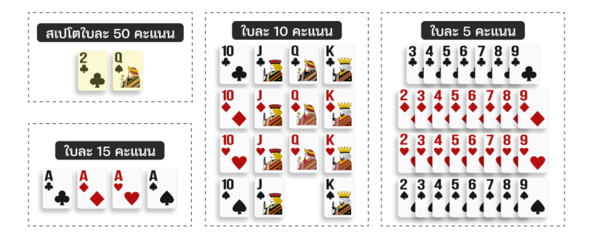

# กติกาไพ่ดัมมี่ (Dummy Legends)

> สอนเล่นดัมมี่ กติกาหลักๆ เข้าใจง่ายไม่ยุ่งยาก พร้อมสรุปแต้มหัวข้อสำคัญสำหรับผู้เล่นใหม่

## ข้อมูลพื้นฐาน

- **จำนวนผู้เล่น:** 2-4 คน (มาตรฐานไทย)
- **จำนวนไพ่เริ่มต้น:**
  - ผู้เล่น 2 คน แจกคนละ **11 ใบ**
  - ผู้เล่น 3 คน แจกคนละ **9 ใบ**
  - ผู้เล่น 4 คน แจกคนละ **7 ใบ**
- **จุดประสงค์หลัก:** เกิดไพ่ ฝากไพ่สะสมคะแนน และป้องกันไม่ให้ผู้อื่นน็อกก่อนเรา

## วิธีการเล่นโดยสรุป

1. ในแต่ละตาผู้เล่นต้องเลือกว่าจะ **จั่วไพ่จากกองจั่ว** หรือ **เก็บไพ่จากกองกลาง** 1 ใบ
2. จัดไพ่ในมือให้เป็นชุด “เรียง” หรือ “ตอง” เพื่อ **เกิด** หรือ **ฝาก**
3. ทิ้งไพ่ 1 ใบลงกองกลาง แล้ววนให้ผู้เล่นคนถัดไปทำต่อ
4. เล่นต่อไปจนกว่าจะมีผู้เล่นน็อก หรือไพ่ในกองจั่วหมด

เกมจะให้แต้มจากการเกิดหรือฝาก และเปรียบเทียบคะแนนเมื่อจบเกม ใครแต้มสูงสุดถือว่าชนะ

## เงื่อนไขการจบเกม

- มีผู้เล่น **น็อก** (จัดไพ่หมดมือ เหลือไพ่ทิ้ง 1 ใบ)
- ไพ่ในกองจั่วหมด และผู้เล่นถัดไปไม่สามารถเก็บไพ่นั้นเพื่อน็อกได้

## ข้อควรระวัง

ดัมมี่มีทั้งแต้มบวกและแต้มลบ จึงต้องระวังการทิ้งไพ่ที่อาจช่วยให้คู่ต่อสู้เกิดหรือน็อกได้ ผู้เล่นจึงต้องใช้ทั้งกลยุทธ์และการคำนวณตลอดเกม

## กติกาสำคัญ

### การเกิด

- หยิบไพ่จากกองกลางอย่างน้อย 1 ใบมาจัดเป็นชุด “เรียง” หรือ “ตอง” และวางลงเพื่อทำคะแนน
- หากชุดที่เกิดมี **สเปโต (2♣ หรือ Q♠)** จะได้รับแต้มเพิ่ม เช่น 2♦ + 2♠ + 2♣(สเปโต) = 5 + 5 + 50 คะแนน

### การเก็บหัว

- “หัว” คือไพ่ใบบนสุดของกองกลาง หากเกิดโดยใช้หัวมารวมในชุดจะได้เพิ่มอีก +50 แต้ม
- ถ้าหัวเป็นสเปโตจะได้ถึง +100 แต้ม

### การฝาก

- หลังจากเกิดแล้ว สามารถนำไพ่ที่เหลือในมือไปฝากเพิ่มกับชุดของตนเองหรือของผู้เล่นอื่นได้ เช่น กอง 3♠ 4♠ 5♠ หากฝาก 2♠ กับ 6♠ จะได้เพิ่มใบละ +5 แต้ม
- ฝากสเปโต (2♣ หรือ Q♠) จะได้ +50 แต้มทันที

### การน็อก

- ผู้เล่นต้องจัดไพ่จนเหลือใบสุดท้ายเพียง 1 ใบ และทิ้งลงกลางโต๊ะ ถือว่าน็อก ได้ +50 แต้ม
- หากไพ่ในกองจั่วหมด ผู้เล่นที่จั่วใบสุดท้ายแล้วทิ้ง แต่คนถัดมาไม่สามารถเก็บไปน็อกได้ เกมจะจบและผู้เล่นนั้นได้ +50 แต้ม

### น็อกรูปแบบพิเศษ

- **น็อกมืด:** ไม่เคยเกิดเลยแต่สามารถน็อกได้ รับ +50 แต้ม และคูณคะแนนรวม x2
- **น็อกสี:** น็อกด้วยไพ่ชุดและใบฝากที่เป็นดอกเดียวกันทั้งหมด รับ +50 แต้ม และคูณคะแนนรวม x2
- **น็อกมืดสี:** รวมเงื่อนไขทั้ง “ไม่เคยเกิด” และ “เป็นดอกเดียวกันทั้งหมด” รับ +50 แต้ม และคูณคะแนนรวม x4

## การนับแต้ม

### แต้มบวก

- **ไพ่หัว:** +50 แต้ม (ใบแรกบนกองจั่ว)
- **เกิดและคว่ำสเปโต:** +50 แต้ม (2♣ หรือ Q♠)
- **ฝากสเปโต:** +50 แต้ม (ฝาก 2♣ หรือ Q♠ กับกองของผู้เล่นอื่น)
- **น็อก:** +50 แต้มขึ้นไป (ขึ้นอยู่กับไพ่ที่จัดได้)
- **น็อกมืด:** +50 แต้ม x2
- **น็อกสี:** +50 แต้ม x2
- **น็อกมืดสี:** +50 แต้ม x4

### แต้มลบ

- **ทิ้งมี่:** -50 แต้ม (ทิ้งไพ่ที่คนอื่นสามารถนำไปเกิดได้ทันที)
- **ทิ้งปี้หัว:** -50 แต้ม (ทิ้งไพ่ที่เกิดกับหัวได้ในรอบนั้น)
- **ทิ้งเต็ม:** -50 แต้ม (ทิ้งไพ่ที่ทำให้คนอื่นเรียงหรือตองกับกองกลางได้อย่างน้อย 2 ใบ)
- **ถูกฝากสเปโต:** -50 แต้ม (ลงชุดที่เปิดโอกาสให้คนอื่นฝากสเปโต)
- **ทิ้งโง่:** -50 แต้ม (ทิ้งไพ่แล้วผู้เล่นถัดไปเก็บไปน็อก)
- **ลบมืด:** แต้มติดลบ x2 ของคะแนนตัวเองทั้งหมด (ไม่เคยเกิดแล้วถูกน็อกก่อน)

## สรุป

ดัมมี่เป็นเกมที่ผสมผสานทั้งโชคและกลยุทธ์ ผู้เล่นต้องบริหารไพ่ให้ดี รู้จังหวะเกิด ฝาก และทิ้ง พร้อมทั้งระวังไม่ให้คู่ต่อสู้ได้ไพ่สำคัญ ใช้กติกาเหล่านี้เป็นพื้นฐานในการพัฒนาสู่การเป็น Dummy Legends!
